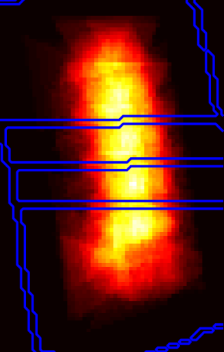
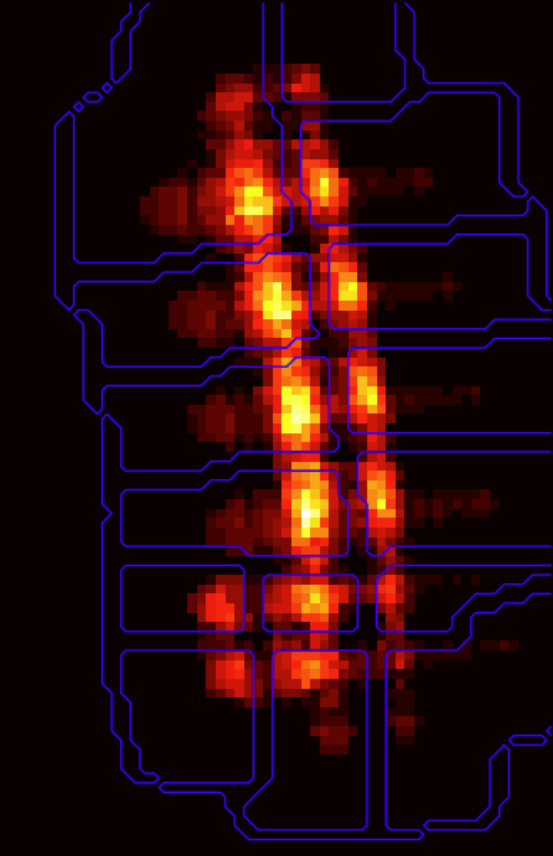
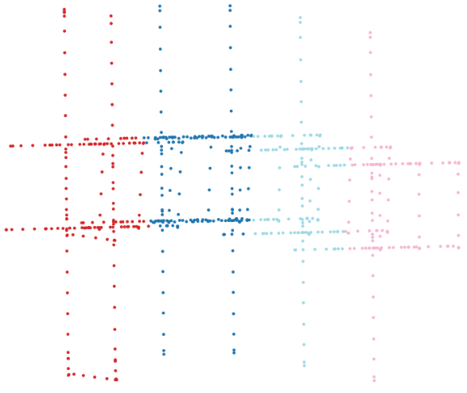
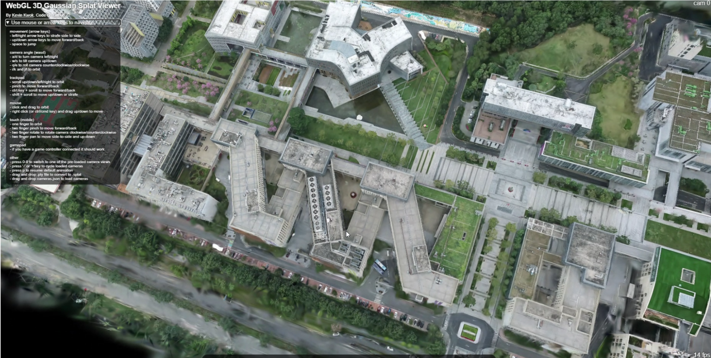
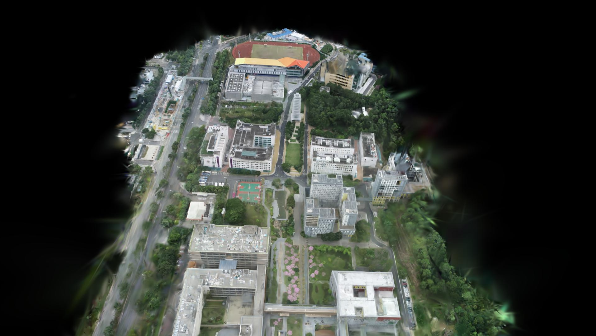
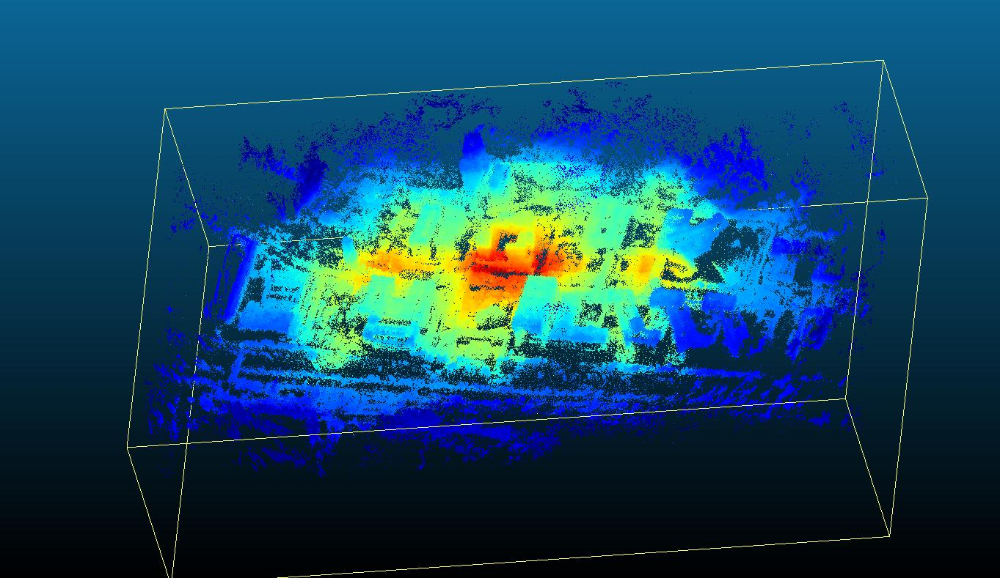
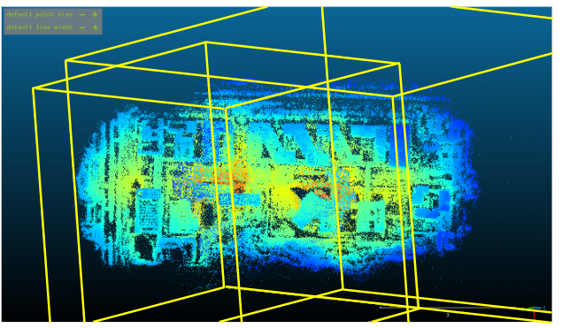

# Seperation Gaussian

Most of current code is the same as original Gaussian Splatting. 

We add a new code for seperation

- We have multiple different submodule, to clone them do:
```
 git clone https://github.com/saliteta/sep_gaussian.git --recursive
```

- And then install the environment: 
```
  conda env create -f environment.yml 
```


- Downloading the dataset or create the dataset
The large scale dataset should be downloaded or created
The structure should looks like the following: 
```
-- dataset
  |--images\ # folder for storing images  
  |--sparse\ # colmap sparse reconstruction
```


- To run it, simply change the following code with "{}" in run.sh:
```
#!/bin/bash
max_concurrent_processes=4
dataset_path="{The Location of your dataaset}"/ # MUST END WITH / !!!
colmap_path=${dataset_path}sparse/0
image_path=${dataset_path}images
output="{place to save you output model}"/ # MUST END WITH / !!!
separation_folder=${output}seperation/ # Define the separation folder
model_folder=${output}models
gpus=(0 1 2 3)
gpu_count=${#gpus[@]} # List of GPUs to use
base_port=6200
```

We provide an example in run.sh. One can also use ./run.sh


# Output and Examples

## Output
There are several output from one training and one evaluation
Under the root folder of your output folder, we have 3 folder and one file
```
--root_output_folder
  |--merged_filtered.ply #the point cloud that first filter and merged together, one used for rendering or downstream application
  |--eval
     |--report.csv # The PSNR, SSIM, and LPIPS result for the current scene
     |--rendered_image1.png
     |--rendered_image2.png
     ...
  |--models
     |--training.log # Training log that will be updated during training 
     |--confidence_heatmap.ply # This is the cofidence map for filtering and merge
     |--point_cloud
        |--iteration_7000
        |--iteration_30000
  |--seperation
     |--summary.png # This is a summary of how the seperation is going
     |--0 # This is a colmap folder
        |--camera.bin
        |--points3D.bin
        |--images.bin
        |--points3D.ply
     |--1
      ...
```


## Example
- Seperation

One can display the attention of each block on a 2D image, and we seperation method seperate along the edges
<div style="display: flex; align-items: center;">
  
  
  
</div>

- Model
For each block, we can simply load it to a web-based render app: https://github.com/antimatter15/splat, rendered result is displayed at the left handside 
For loading the merged filtered result, we use the Adaptive Level of Detailed Rendering Engine, the result displayed in the right handside
<div style="display: flex; align-items: center;">
  
  
</div>

- Attention/Confidence Map
<div style="display: flex; align-items: center;">
  
  
</div>